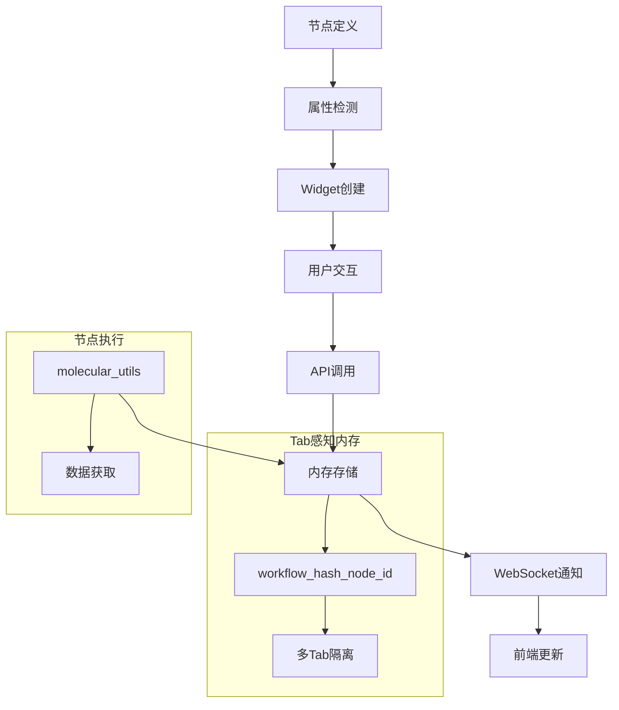

# ALCHEM_PropBtn 架构文档

## 🏗️ 系统架构概览

ALCHEM_PropBtn 采用**方案B架构**（节点主动数据获取模式），实现了分子文件的上传、处理、3D显示和实时编辑功能。

### 架构特点

- 🎯 **属性驱动**: 通过节点属性自动启用功能
- 🔄 **前后端分离**: JavaScript前端 + Python后端
- 🧠 **智能内存管理**: Tab感知的数据隔离
- 📡 **实时同步**: WebSocket驱动的数据更新
- 🔧 **模块化设计**: 松耦合的功能组件

## 📊 数据流架构



## 🔧 核心组件

### 1. 属性驱动系统

#### 节点定义（Python）
```python
# 在节点的 INPUT_TYPES 中声明功能
"molecular_file": ("STRING", {
    "molecular_upload": True,       # 启用上传功能
    "molstar_3d_display": True,     # 启用3D显示  
    "molecular_folder": "molecules" # 存储目录
})
```

#### 前端检测（JavaScript）
```javascript
// extensionMain.js 自动检测属性并创建Widget
const process3DDisplayNodes = (nodeType, nodeData) => {
    const found3DDisplay = Object.entries(required).find(([_, inputSpec]) =>
        inputSpec[1]?.molstar_3d_display === true
    );
    
    if (found3DDisplay) {
        // 自动添加3D显示和编辑按钮
        return createMolstar3DDisplayInput(inputName, inputSpec);
    }
};
```

### 2. Tab感知内存管理

#### 存储策略
```python
# backend/memory.py
# 格式: workflow_{tab_hash}_node_{node_id}
node_id = f"workflow_fl40l5_node_23"

# 多Tab隔离
MOLECULAR_DATA_CACHE = {
    "workflow_fl40l5_node_23": {...},  # Tab A 的节点23
    "workflow_x8k2n_node_23": {...}   # Tab B 的节点23 (同ID但不同Tab)
}
```

#### 智能ID生成
```javascript
// modules/data-processor.js
generateUniqueNodeId(node) {
    const tabId = this.getTabId(node);  // 获取当前Tab标识
    return `${tabId}_node_${node.id}`;  // 生成唯一ID
}
```

### 3. 严格节点ID绑定

#### 问题背景
原系统中编辑按钮通过文件名查找数据，导致同名文件的节点间数据混乱。

#### 解决方案
```javascript
// custom3DDisplay.js - 修复后的编辑逻辑
export const editMolecularData = async (node, inputName, editType) => {
    const dataProcessor = alchem3DCoordinator.getDataProcessor();
    const currentNodeId = dataProcessor.generateUniqueNodeId(node);
    
    // 🔑 严格使用当前节点ID，禁止文件名查找
    const targetNodeId = currentNodeId;
    
    // 直接使用节点ID进行编辑操作
    const response = await fetch('/alchem_propbtn/api/molecular', {
        method: 'POST',
        body: JSON.stringify({
            request_type: 'edit_molecular_data',
            node_id: targetNodeId,  // 严格绑定
            edit_type: editType
        })
    });
};
```

### 4. WebSocket实时同步

#### 服务器端（Python）
```python
# backend/websocket_server.py
class WebSocketServer:
    async def handle_client(self, websocket, path):
        # 连接管理和心跳检测
        self.clients.add(websocket)
        
    async def broadcast_molecular_change(self, node_id, change_type):
        # 推送数据变更通知
        message = {
            "type": "molecular_data_changed",
            "node_id": node_id,
            "change_type": change_type
        }
        await self._broadcast(message)
```

#### 客户端（JavaScript）
```javascript
// modules/websocket-client.js
class WebSocketClient {
    subscribeNode(nodeId) {
        this.subscribedNodes.add(nodeId);
        // 订阅特定节点的数据变更
    }
    
    on('molecular_data_changed', (message) => {
        // 自动刷新3D显示
        this.handleMolecularDataChange(message);
    });
}
```

## 🔀 模块间通信

### 前端模块协调

```javascript
// custom3DDisplay.js - 主协调器
class ALCHEM3DDisplayCoordinator {
    constructor() {
        this.panelManager = new ALCHEM3DPanelManager();    // UI管理
        this.dataProcessor = new MolecularDataProcessor(); // 数据处理
        this.webSocketClient = webSocketClient;            // 实时同步
    }
    
    async show3DMolecularView(node, inputName) {
        // 1. 生成节点ID
        const nodeId = this.dataProcessor.generateUniqueNodeId(node);
        
        // 2. 订阅WebSocket更新
        this.subscribeNodeUpdates(nodeId);
        
        // 3. 获取数据并显示
        const data = await this.dataProcessor.fetchMolecularDataFromBackend(nodeId);
        this.panelManager.displayMolecularData(data);
    }
}
```

### 后端API设计

```python
# backend/api.py
@app.route('/alchem_propbtn/api/molecular', methods=['POST'])
async def handle_molecular_request(request):
    data = await request.json()
    request_type = data.get('request_type')
    
    if request_type == 'get_molecular_data':
        return await get_molecular_data(data.get('node_id'))
    elif request_type == 'edit_molecular_data':
        result = await edit_molecular_data(data.get('node_id'), data.get('edit_type'))
        # 编辑后通过WebSocket通知
        await websocket_server.broadcast_molecular_change(data.get('node_id'), 'edited')
        return result
```

## 🎯 关键设计决策

### 1. 为什么选择方案B架构？

- **灵活性**: 节点可以通过属性声明需要的功能
- **模块化**: 功能模块独立，易于维护
- **扩展性**: 新增功能只需添加新的属性检测
- **兼容性**: 不影响ComfyUI核心功能

### 2. Tab感知的必要性

- **问题**: 多Tab环境下相同节点ID会产生数据冲突
- **解决**: 基于Tab标识生成唯一的存储key
- **优势**: 完全隔离不同Tab的数据，避免干扰

### 3. 严格节点ID绑定

- **问题**: 文件名查找导致同名文件节点间数据混乱
- **解决**: 所有UI操作强制绑定到节点ID
- **效果**: 每个节点的操作完全独立，数据安全

## 🔍 性能优化

### 内存管理
- **缓存策略**: 基于LRU的自动清理
- **数据压缩**: 大文件内容压缩存储
- **状态监控**: 实时缓存使用情况

### 网络优化
- **WebSocket复用**: 单连接多节点订阅
- **数据增量**: 只传输变更的数据部分
- **连接管理**: 自动重连和心跳检测

### UI优化
- **按需加载**: MolStar库按需加载
- **虚拟化**: 大分子结构的渲染优化
- **响应式**: 自适应不同屏幕尺寸

## 🚀 扩展指南

### 添加新的Widget类型

1. **定义属性**:
```python
"new_feature": ("STRING", {
    "custom_new_widget": True,
    "widget_options": {...}
})
```

2. **前端检测**:
```javascript
// extensionMain.js
const processNewWidget = (nodeType, nodeData) => {
    // 检测 custom_new_widget 属性
    // 创建对应的Widget
};
```

3. **功能实现**:
```javascript
// 创建新的模块文件
// 实现Widget的交互逻辑
```

### 添加新的API端点

1. **后端路由**:
```python
# backend/api.py
@app.route('/alchem_propbtn/api/new_feature', methods=['POST'])
async def handle_new_feature(request):
    # 实现新功能的API逻辑
    pass
```

2. **前端调用**:
```javascript
// modules/api-client.js
async callNewFeatureAPI(data) {
    return await this.post('/alchem_propbtn/api/new_feature', data);
}
```

## 📝 最佳实践

### 代码质量
- **函数长度**: 控制在50行以内
- **模块职责**: 单一责任原则
- **错误处理**: 优雅的错误处理和用户提示

### 调试和测试
- **日志系统**: 使用统一的ALCHEM日志系统
- **调试工具**: 利用浏览器控制台的debug函数
- **测试节点**: 使用test_simple_node进行功能验证

### 性能考虑
- **内存使用**: 及时清理不需要的缓存
- **网络请求**: 避免不必要的API调用
- **UI响应**: 长时间操作使用进度指示器