# ALCHEM_PropBtn 架构文档

## 🏗️ 系统架构概览

ALCHEM_PropBtn 采用**方案B架构**（节点主动数据获取模式），结合**Mixin设计模式**，实现了分子文件的上传、处理、3D显示和实时编辑功能。

### 架构特点

- 🎯 **属性驱动**: 通过节点属性自动启用功能
- 🔄 **前后端分离**: JavaScript前端 + Python后端
- 🧠 **智能内存管理**: Tab感知的数据隔离
- 📡 **实时同步**: WebSocket驱动的数据更新
- 🔧 **模块化设计**: 松耦合的功能组件
- 🧪 **Mixin架构**: 统一的3D显示功能混入，简化节点开发

## 📊 数据流架构

```mermaid
graph TB
    A[节点定义] --> B[属性检测]
    B --> C[Widget创建]
    C --> D[用户交互]
    D --> E[API调用]
    E --> F[内存存储]
    F --> G[WebSocket通知]
    G --> H[前端更新]
    
    subgraph "Tab感知内存"
        F --> I[workflow_hash_node_id]
        I --> J[多Tab隔离]
    end
    
    subgraph "节点执行"
        K[molecular_utils] --> F
        K --> L[数据获取]
    end
```



## 🔧 核心组件

### 1. MolstarDisplayMixin 统一架构

#### 🧪 Mixin设计模式优势
- **代码减少90%**: 从400+行简化到30-50行
- **零配置3D显示**: 一行代码启用完整功能
- **标准化错误处理**: 统一的异常处理模板
- **自动节点ID管理**: Tab感知的唯一ID生成
- **严格数据隔离**: 避免重名文件数据混乱

#### 节点定义（传统方式 vs Mixin方式）

**❌ 传统方式（复杂且容易出错）:**
```python
# 需要手动配置大量属性
"molecular_file": ("STRING", {
    "default": "molecule.pdb",
    "molecular_upload": True,        # 启用上传按钮
    "molstar_3d_display": True,      # 启用3D显示按钮
    "molecular_folder": "molecules", # 存储文件夹
    "display_mode": "ball_and_stick", # 3D显示模式
    "background_color": "#1E1E1E",   # 3D背景色
    "tooltip": "分子文件 - 支持上传和3D显示"
}),
"_alchem_node_id": ("STRING", {"default": ""})  # 隐藏的节点ID参数
```

**✅ Mixin方式（一行代码自动生成）:**
```python
from .mixins.molstar_display_mixin import MolstarDisplayMixin

class YourNode(MolstarDisplayMixin):
    @classmethod
    def INPUT_TYPES(cls):
        return {
            "required": {
                **cls.get_molstar_input_config("molecular_file"),  # 🔑 自动生成所有配置
                # 你的其他参数...
                "analysis_type": (["basic", "detailed"], {"default": "basic"})
            }
        }
```

### 2. 两种标准节点模式

#### 🔸 输入节点（Upload/Source Nodes）
**特征**: 接收文件名，提供内容输出，通常是工作流的起点

```python
class SimpleMolecularAnalyzer(MolstarDisplayMixin):
    @classmethod
    def INPUT_TYPES(cls):
        return {
            "required": {
                **cls.get_molstar_input_config("molecular_file"),  # 📁上传+🧪3D显示
                "analysis_type": (["basic", "detailed"], {"default": "basic"})
            }
        }
    
    def analyze_molecule(self, molecular_file, analysis_type, **kwargs):
        # 🔑 一行代码获取分子数据
        content, metadata = self.get_molecular_data(molecular_file, kwargs)
        
        # 🔑 一行代码验证数据
        if not self.validate_molecular_data(metadata):
            return self.create_error_output(metadata)
        
        # 🚀 专注业务逻辑
        result = self._perform_analysis(content, metadata, analysis_type)
        return (result, content, self.generate_debug_info(kwargs.get('_alchem_node_id'), metadata))
```

#### 🔸 中间节点（Processing/Transform Nodes）
**特征**: 接收内容输入，进行处理，输出处理后的内容

```python
class SimpleTabAwareProcessor(MolstarDisplayMixin):
    @classmethod
    def INPUT_TYPES(cls):
        return {
            "required": {
                **cls.get_processing_input_config(
                    content_param="input_molecular_content",  # 内容输入
                    output_param="output_filename"            # 🧪3D显示文件名
                ),
                "processing_type": (["remove_hydrogens", "center_molecule"], {"default": "remove_hydrogens"})
            }
        }
    
    def process_molecular_data(self, input_molecular_content, output_filename, processing_type, **kwargs):
        # 🔑 一行代码完成整个处理流程！
        return self.process_direct_content(
            content=input_molecular_content,
            output_filename=output_filename,
            node_id=kwargs.get('_alchem_node_id', ''),
            processing_func=self._process_molecular_content,
            processing_type=processing_type
        )
```

#### 前端自动检测（JavaScript）
```javascript
// extensionMain.js 自动检测属性并创建Widget
const process3DDisplayNodes = (nodeType, nodeData) => {
    const found3DDisplay = Object.entries(required).find(([_, inputSpec]) =>
        inputSpec[1]?.molstar_3d_display === true
    );
    
    if (found3DDisplay) {
        // 自动添加3D显示和编辑按钮
        return createMolstar3DDisplayInput(inputName, inputSpec);
    }
};
```

### 3. 严格节点ID绑定系统

#### 🔑 核心原则：完全基于节点ID的数据隔离

**问题背景**: 原系统中多个节点使用相同文件名（如`processed_molecule.pdb`）时会产生数据混乱

**解决方案**: 严格节点ID绑定 + 文件重名保护

#### 存储策略（Tab感知）
```python
# backend/memory.py - Tab感知的唯一存储key
# 格式: workflow_{tab_hash}_node_{node_id}
node_id = f"workflow_fl40l_node_95"

# 多Tab+多节点完全隔离
MOLECULAR_DATA_CACHE = {
    "workflow_fl40l_node_78": {    # Tab A的节点78
        "filename": "BZN.pdb",
        "content": "...",
        "tab_id": "workflow_fl40l"
    },
    "workflow_fl40l_node_95": {    # Tab A的节点95 
        "filename": "processed_molecule.pdb",  # 🔑 相同文件名但不同节点
        "content": "...",
        "tab_id": "workflow_fl40l"
    },
    "workflow_fl40l_node_101": {   # Tab A的节点101
        "filename": "processed_molecule.pdb",  # 🔑 相同文件名但不同节点  
        "content": "...",
        "tab_id": "workflow_fl40l"
    }
}
```

#### 文件系统重名保护
```python
# backend/memory.py - _save_to_filesystem()
def _save_to_filesystem(filename, folder, content, node_id):
    if node_id:
        # 🔑 修复：为重名文件添加节点ID后缀
        node_suffix = node_id.split('_node_')[-1]  # 提取节点数字
        unique_filename = f"{name}_node{node_suffix}.{ext}"
        # processed_molecule.pdb → processed_molecule_node95.pdb
        # processed_molecule.pdb → processed_molecule_node101.pdb
```

#### 前后端ID一致性保证
```python
# nodes/mixins/molstar_display_mixin.py - _get_tab_aware_node_id()
def _get_tab_aware_node_id(self, real_node_id: str) -> str:
    # 🔑 修复：使用与前端一致的tab_id格式
    existing_tab_ids = [data.get('tab_id') for data in MOLECULAR_DATA_CACHE.values()]
    if existing_tab_ids:
        tab_id = sorted(existing_tab_ids)[-1]  # 使用已存在的tab_id
    else:
        tab_id = "workflow_fl40l"  # 与前端simpleHash()一致的默认值
    
    return f"{tab_id}_node_{real_node_id}"
```

#### 智能ID生成
```javascript
// modules/data-processor.js
generateUniqueNodeId(node) {
    const tabId = this.getTabId(node);  // 获取当前Tab标识
    return `${tabId}_node_${node.id}`;  // 生成唯一ID
}
```

### 3. 严格节点ID绑定

#### 问题背景
原系统中编辑按钮通过文件名查找数据，导致同名文件的节点间数据混乱。

#### 解决方案
```javascript
// custom3DDisplay.js - 修复后的编辑逻辑
export const editMolecularData = async (node, inputName, editType) => {
    const dataProcessor = alchem3DCoordinator.getDataProcessor();
    const currentNodeId = dataProcessor.generateUniqueNodeId(node);
    
    // 🔑 严格使用当前节点ID，禁止文件名查找
    const targetNodeId = currentNodeId;
    
    // 直接使用节点ID进行编辑操作
    const response = await fetch('/alchem_propbtn/api/molecular', {
        method: 'POST',
        body: JSON.stringify({
            request_type: 'edit_molecular_data',
            node_id: targetNodeId,  // 严格绑定
            edit_type: editType
        })
    });
};
```

### 4. WebSocket实时同步

#### 服务器端（Python）
```python
# backend/websocket_server.py
class WebSocketServer:
    async def handle_client(self, websocket, path):
        # 连接管理和心跳检测
        self.clients.add(websocket)
        
    async def broadcast_molecular_change(self, node_id, change_type):
        # 推送数据变更通知
        message = {
            "type": "molecular_data_changed",
            "node_id": node_id,
            "change_type": change_type
        }
        await self._broadcast(message)
```

#### 客户端（JavaScript）
```javascript
// modules/websocket-client.js
class WebSocketClient {
    subscribeNode(nodeId) {
        this.subscribedNodes.add(nodeId);
        // 订阅特定节点的数据变更
    }
    
    on('molecular_data_changed', (message) => {
        // 自动刷新3D显示
        this.handleMolecularDataChange(message);
    });
}
```

## 🔀 模块间通信

### 前端模块协调

```javascript
// custom3DDisplay.js - 主协调器
class ALCHEM3DDisplayCoordinator {
    constructor() {
        this.panelManager = new ALCHEM3DPanelManager();    // UI管理
        this.dataProcessor = new MolecularDataProcessor(); // 数据处理
        this.webSocketClient = webSocketClient;            // 实时同步
    }
    
    async show3DMolecularView(node, inputName) {
        // 1. 生成节点ID
        const nodeId = this.dataProcessor.generateUniqueNodeId(node);
        
        // 2. 订阅WebSocket更新
        this.subscribeNodeUpdates(nodeId);
        
        // 3. 获取数据并显示
        const data = await this.dataProcessor.fetchMolecularDataFromBackend(nodeId);
        this.panelManager.displayMolecularData(data);
    }
}
```

### 后端API设计

```python
# backend/api.py
@app.route('/alchem_propbtn/api/molecular', methods=['POST'])
async def handle_molecular_request(request):
    data = await request.json()
    request_type = data.get('request_type')
    
    if request_type == 'get_molecular_data':
        return await get_molecular_data(data.get('node_id'))
    elif request_type == 'edit_molecular_data':
        result = await edit_molecular_data(data.get('node_id'), data.get('edit_type'))
        # 编辑后通过WebSocket通知
        await websocket_server.broadcast_molecular_change(data.get('node_id'), 'edited')
        return result
```

## 🎯 关键设计决策

### 1. 为什么选择方案B架构？

- **灵活性**: 节点可以通过属性声明需要的功能
- **模块化**: 功能模块独立，易于维护
- **扩展性**: 新增功能只需添加新的属性检测
- **兼容性**: 不影响ComfyUI核心功能

### 2. Tab感知的必要性

- **问题**: 多Tab环境下相同节点ID会产生数据冲突
- **解决**: 基于Tab标识生成唯一的存储key
- **优势**: 完全隔离不同Tab的数据，避免干扰

### 3. 严格节点ID绑定

- **问题**: 文件名查找导致同名文件节点间数据混乱
- **解决**: 所有UI操作强制绑定到节点ID
- **效果**: 每个节点的操作完全独立，数据安全

## 🔍 性能优化

### 内存管理
- **缓存策略**: 基于LRU的自动清理
- **数据压缩**: 大文件内容压缩存储
- **状态监控**: 实时缓存使用情况

### 网络优化
- **WebSocket复用**: 单连接多节点订阅
- **数据增量**: 只传输变更的数据部分
- **连接管理**: 自动重连和心跳检测

### UI优化
- **按需加载**: MolStar库按需加载
- **虚拟化**: 大分子结构的渲染优化
- **响应式**: 自适应不同屏幕尺寸

## 🚀 扩展指南

### 添加新的Widget类型

1. **定义属性**:
```python
"new_feature": ("STRING", {
    "custom_new_widget": True,
    "widget_options": {...}
})
```

2. **前端检测**:
```javascript
// extensionMain.js
const processNewWidget = (nodeType, nodeData) => {
    // 检测 custom_new_widget 属性
    // 创建对应的Widget
};
```

3. **功能实现**:
```javascript
// 创建新的模块文件
// 实现Widget的交互逻辑
```

### 添加新的API端点

1. **后端路由**:
```python
# backend/api.py
@app.route('/alchem_propbtn/api/new_feature', methods=['POST'])
async def handle_new_feature(request):
    # 实现新功能的API逻辑
    pass
```

2. **前端调用**:
```javascript
// modules/api-client.js
async callNewFeatureAPI(data) {
    return await this.post('/alchem_propbtn/api/new_feature', data);
}
```

## 📝 最佳实践

### 代码质量
- **函数长度**: 控制在50行以内
- **模块职责**: 单一责任原则
- **错误处理**: 优雅的错误处理和用户提示

### 调试和测试
- **日志系统**: 使用统一的ALCHEM日志系统
- **调试工具**: 利用浏览器控制台的debug函数
- **测试节点**: 使用test_simple_node进行功能验证

### 性能考虑
- **内存使用**: 及时清理不需要的缓存
- **网络请求**: 避免不必要的API调用
- **UI响应**: 长时间操作使用进度指示器