项目放在custom_nodes/ALCHEM_PropBtn_New
本项目是一个基于ComfyUI平台的智能分子编辑与可视化系统，专为计算化学、药物发现、材料科学等科研领域设计的创新工具。通过深度集成ComfyUI的节点化工作流架构，我们构建了一个高效、直观、功能强大的分子数据处理平台。
核心功能与特性
🎯 无缝分子文件管理
智能上传系统：支持PDB、SDF、MOL、XYZ等主流分子格式
格式自动识别：智能检测文件格式并提供相应的处理选项
后端内存优化：文件内容直接存储在服务器内存中，实现毫秒级访问
🧬 实时分子结构编辑
2D/3D协同编辑：同步的二维结构编辑器和三维预览窗口
原子级精确操作：支持添加、删除、修改原子和化学键
版本控制机制：完整的编辑历史追踪和回滚功能

## 🧪 **ComfyUI分子编辑系统完整架构设计**

### 1. **整体系统架构（修正版）**

```mermaid
graph TB
    subgraph "前端扩展层"
        A1[extensionMain.js<br/>主协调器] --> A2[Property检测系统]
        A3[Widget注册中心] --> A4[上传Widget]
        A3 --> A5[编辑Widget]
        A3 --> A6[3D显示Widget]
        
        A7[分子编辑界面] --> A8[2D编辑器]
        A7 --> A9[3D预览]
        A7 --> A10[属性面板]
    end
    
    subgraph "通信层"
        B1[REST API] --> B2[upload文件上传接口]
        B1 --> B3[molecular数据查询接口]
        B4[WebSocket] --> B5[实时编辑同步]
    end
    
    subgraph "后端内存管理"
        C1[MolecularMemoryManager] --> C2[molecular_cache字典]
        C3[数据生命周期管理] --> C4[版本控制]
        C5[执行时数据注入] --> C6[get_input_data拦截]
    end
    
    subgraph "ComfyUI执行层"
        D1[节点执行器] --> D2[输入数据获取]
        D2 --> D3[节点FUNCTION调用]
        D3 --> D4[分子数据处理]
    end
    
    A2 --> A3
    A4 --> B1
    A5 --> B4
    B2 --> C1
    B5 --> C1
    C6 --> D2
```

### 2. **单变量多Property机制详解**

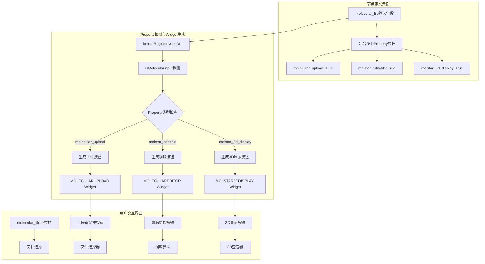

### 3. **数据生命周期和存储策略**

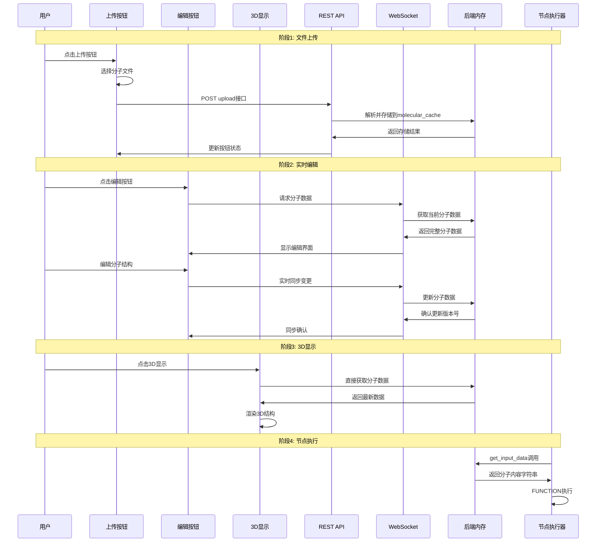

### 4. **后端内存管理架构**

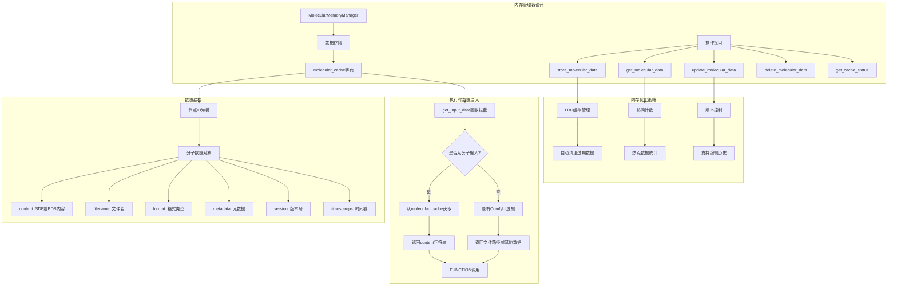

### 5. **前端扩展注册机制**

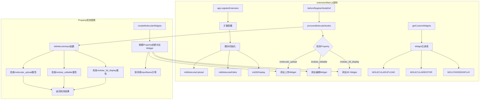

### 6. **WebSocket实时同步机制**

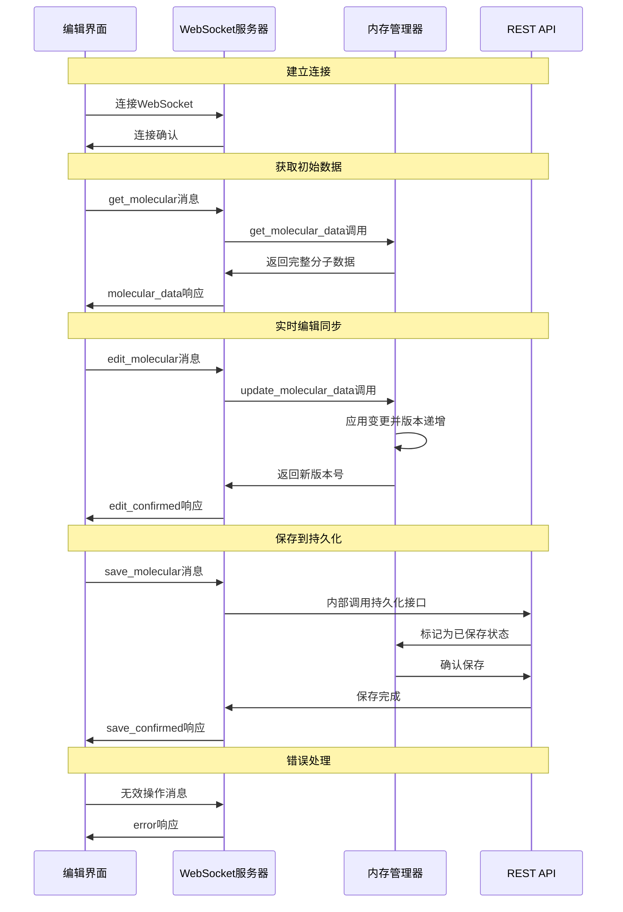

### 7. **分子编辑界面架构**

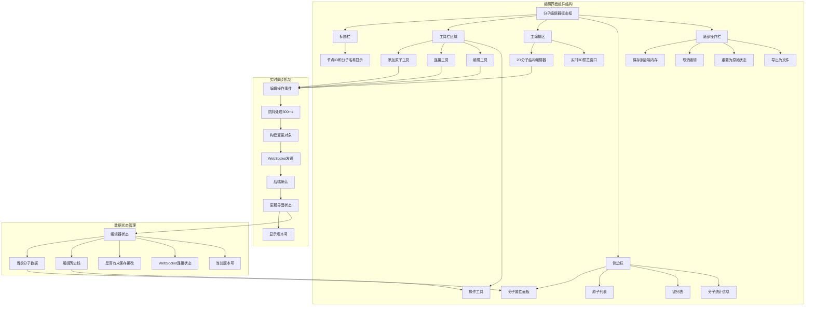

### 8. **关键代码实现架构**

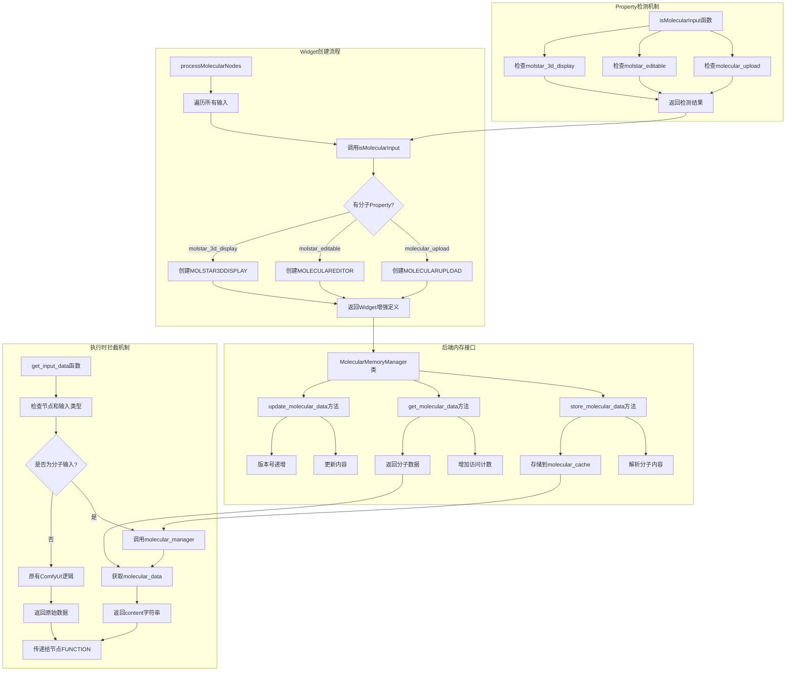

### 9. **WebSocket通信协议架构**

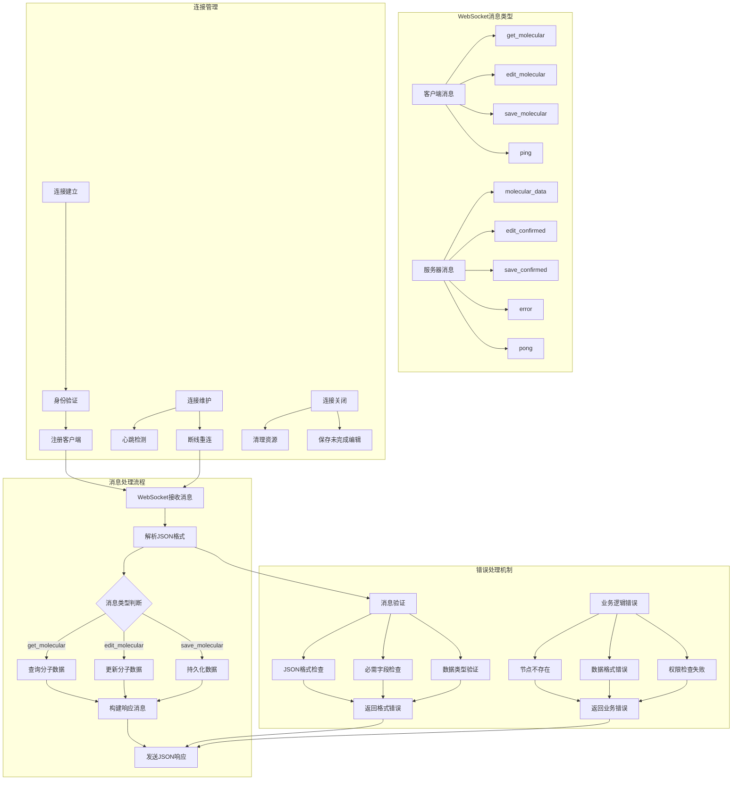

### 10. **数据流状态转换图**

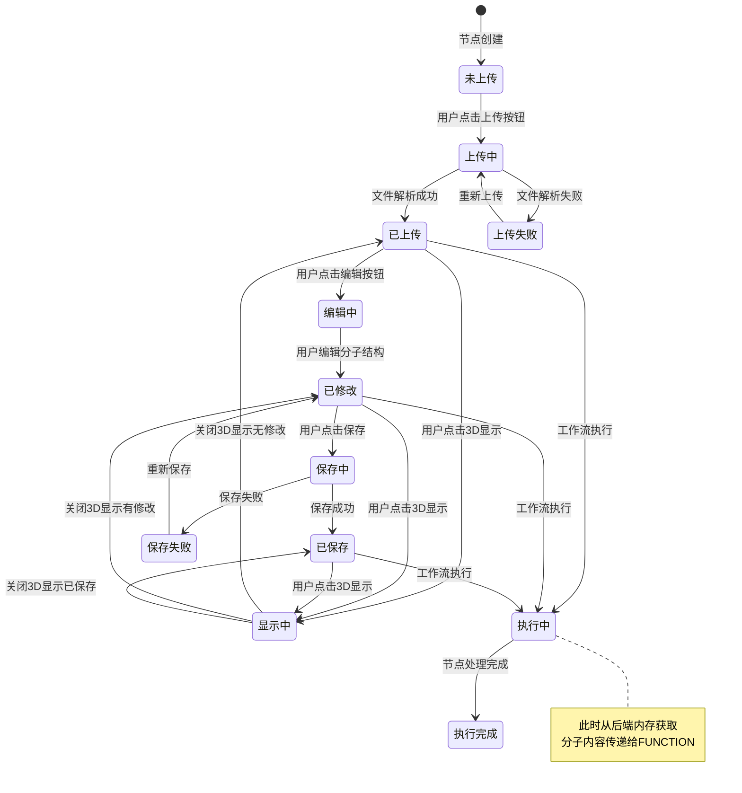

### 11. **性能优化和错误处理**

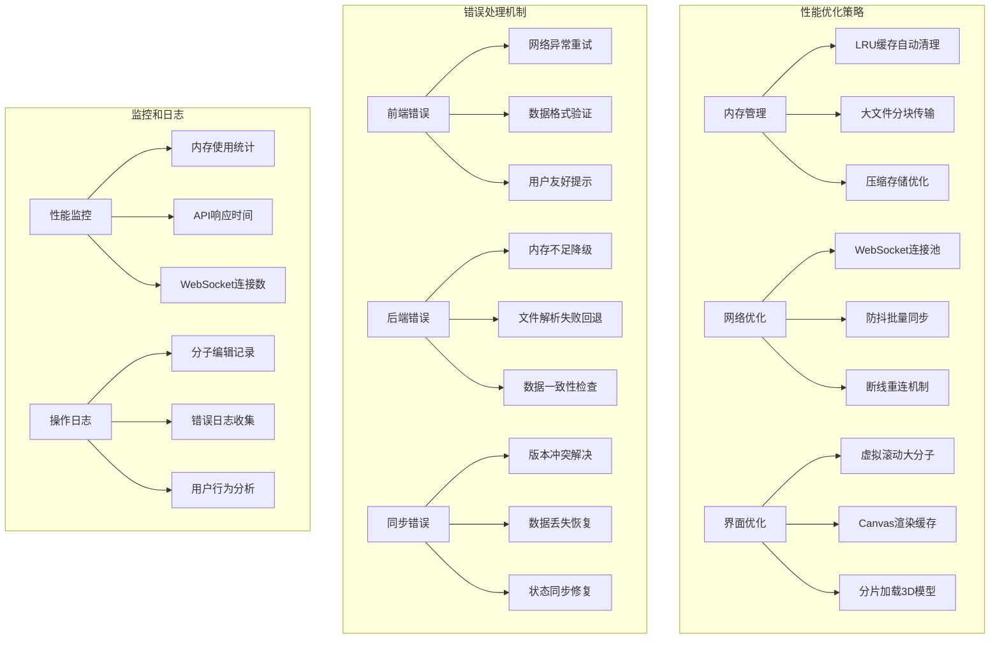

### 12. **系统集成与扩展性**

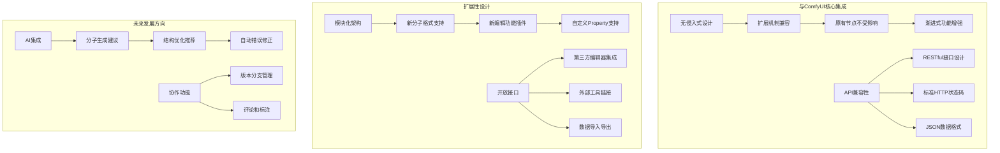

这个完整的架构设计涵盖了：

**核心优势**：
1. **🎯 单变量多Property**：简洁一致的用户体验
2. **🚀 后端内存优先**：毫秒级数据访问，无I/O瓶颈
3. **🔄 实时同步机制**：WebSocket保证前后端数据一致性
4. **🧩 模块化设计**：易于维护和扩展
5. **💪 高性能优化**：多层缓存和优化策略
6. **🛡️ 错误处理完善**：容错性强，用户体验好
7. **🔗 ComfyUI原生集成**：无侵入式设计，完美兼容
