项目放在custom_nodes/ALCHEM_PropBtn_New
本项目是一个基于ComfyUI平台的智能分子编辑与可视化系统，专为计算化学、药物发现、材料科学等科研领域设计的创新工具。通过深度集成ComfyUI的节点化工作流架构，我们构建了一个高效、直观、功能强大的分子数据处理平台。

## 核心功能与特性

### 🎯 无缝分子文件管理
- **智能上传系统**：支持PDB、SDF、MOL、XYZ等主流分子格式
- **格式自动识别**：智能检测文件格式并提供相应的处理选项
- **后端内存优化**：文件内容直接存储在服务器内存中，实现毫秒级访问

### 🧬 实时3D分子结构编辑
- **MolStar 3D编辑**：基于MolStar的专业级三维分子结构编辑器
- **原子级精确操作**：支持添加、删除、修改原子和化学键
- **实时渲染反馈**：编辑操作即时在3D视图中可视化
- **编辑历史追踪**：完整的编辑历史记录和回滚功能
- **高性能同步**：50ms超低延迟的前后端数据同步，确保专业用户流畅操作体验

## 🧪 **ComfyUI分子编辑系统完整架构设计**

### 1. **整体系统架构（专业版）**

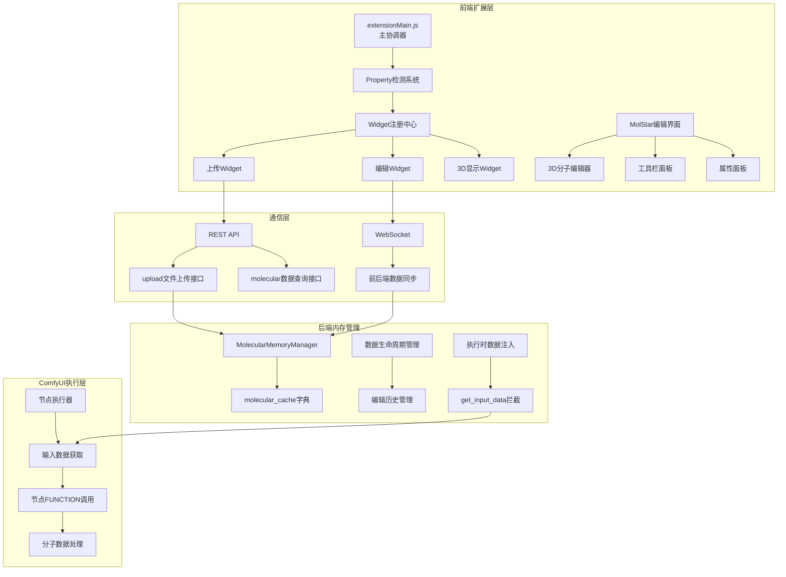

### 2. **单变量多Property机制详解**

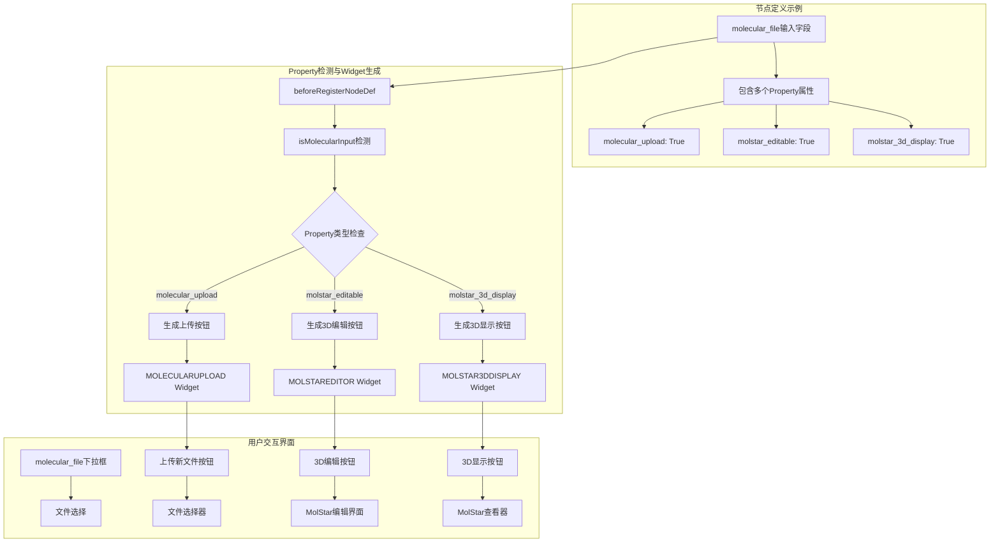

### 3. **数据生命周期和存储策略**

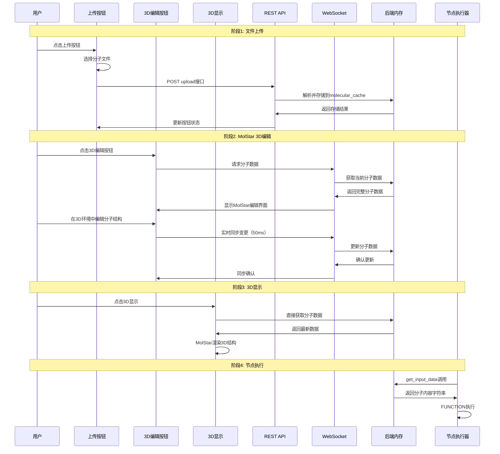

### 4. **后端内存管理架构**

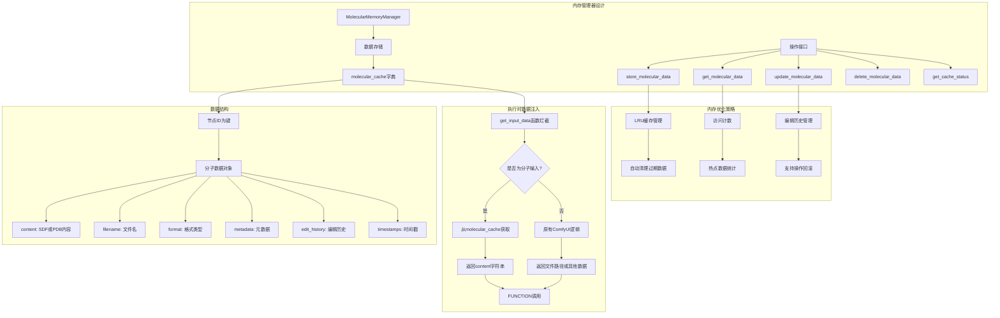

### 5. **前端扩展注册机制**

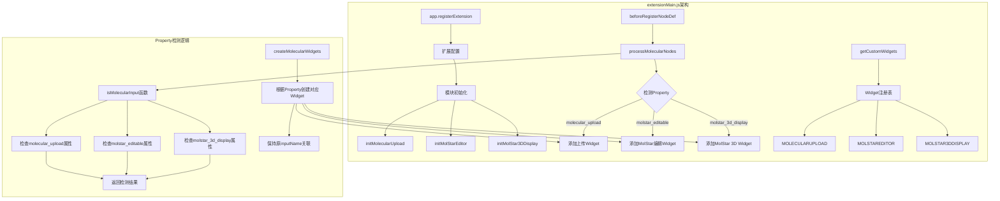

### 6. **WebSocket前后端同步机制**

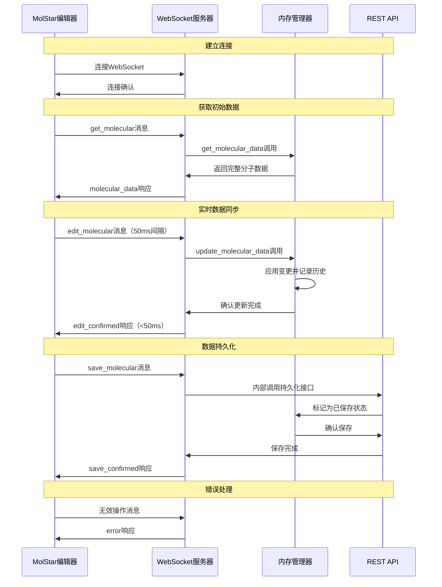

### 7. **MolStar 3D编辑界面架构**

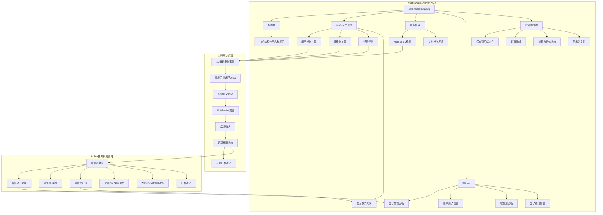

### 8. **关键代码实现架构**

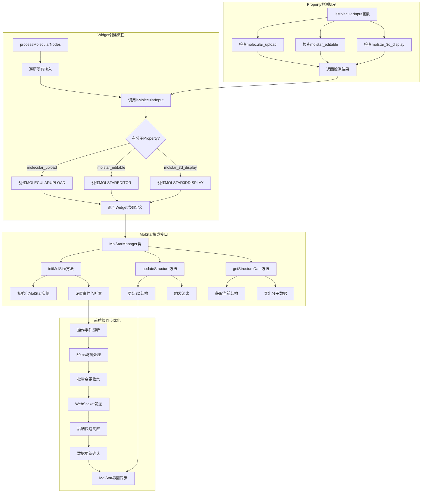

### 9. **WebSocket通信协议架构**

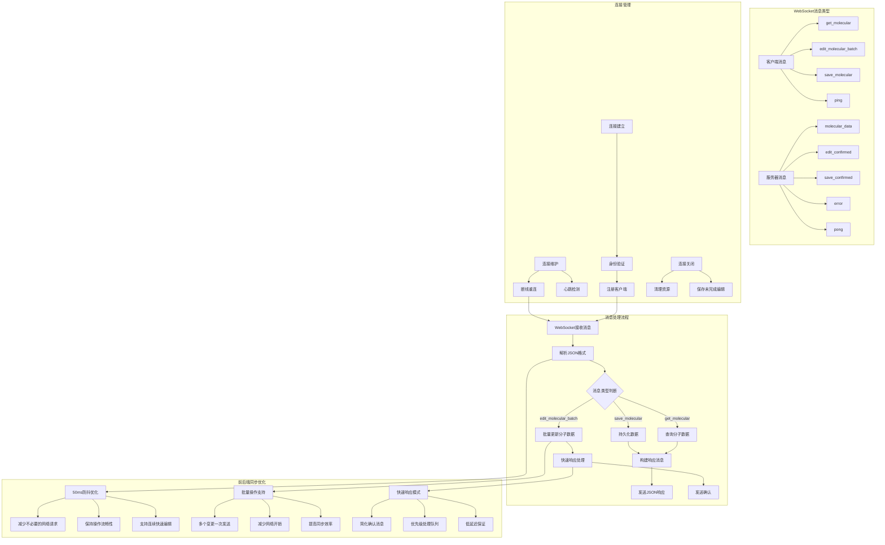

### 10. **数据流状态转换图**

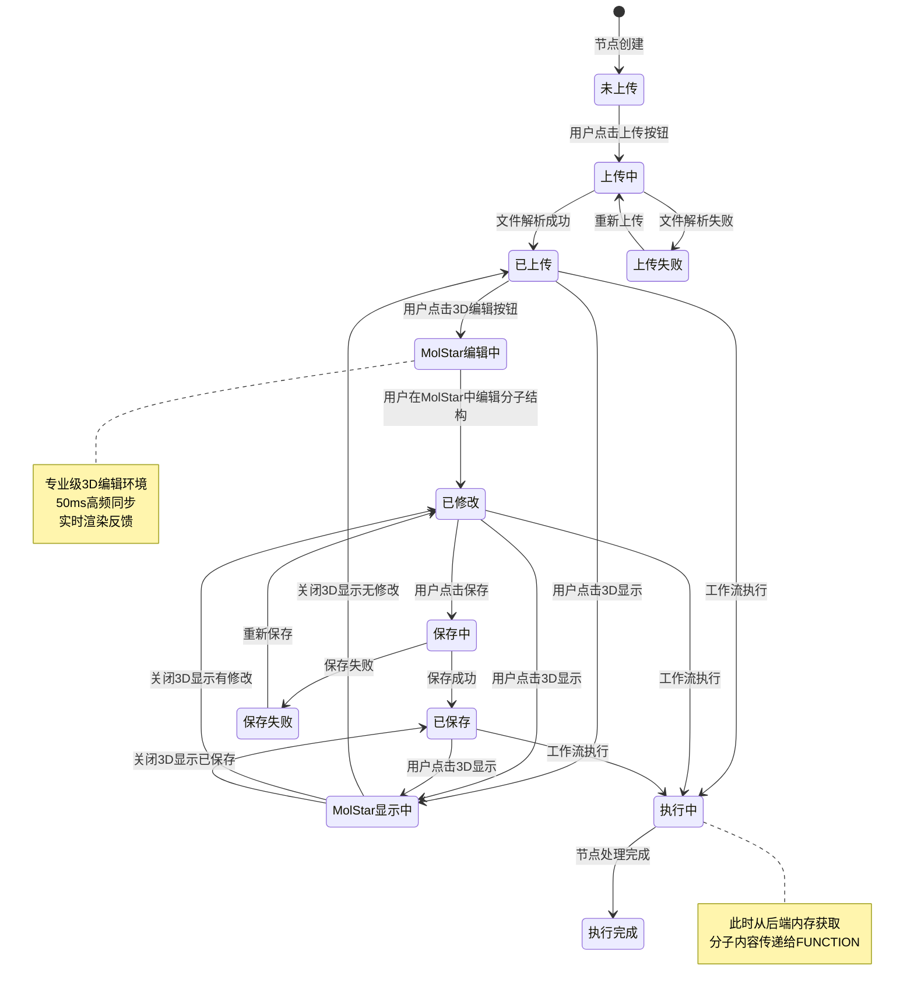

### 11. **性能优化和错误处理**

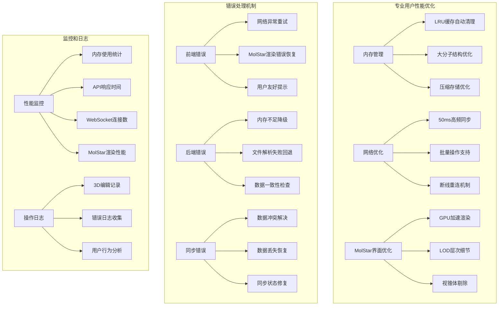

### 12. **系统集成与扩展性**

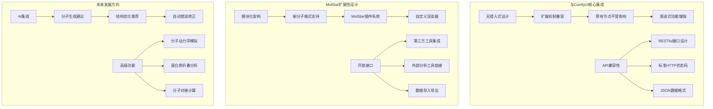

## 🎯 **关键优化特性**

### **专业用户体验优化**
1. **50ms超低延迟同步**：专为专业用户设计的高频前后端数据同步，确保连续编辑操作的流畅性
2. **MolStar专业级3D编辑**：专注于基于MolStar的高质量3D编辑体验，提供专业分子编辑功能
3. **批量操作支持**：智能收集多个编辑操作，减少网络开销，提高同步效率
4. **GPU加速渲染**：利用WebGL优化大分子结构的实时渲染性能

### **技术架构优势**
1. **🎯 单变量多Property**：简洁一致的用户体验
2. **🚀 后端内存优先**：毫秒级数据访问，无I/O瓶颈
3. **🔄 前后端实时同步**：WebSocket保证前后端数据同步，无多人协同复杂性
4. **🧩 模块化设计**：易于维护和扩展
5. **💪 高性能优化**：多层缓存和专业级优化策略
6. **🛡️ 错误处理完善**：容错性强，用户体验好
7. **🔗 ComfyUI原生集成**：无侵入式设计，完美兼容

这个优化后的架构专注于单用户的高性能3D分子编辑体验，通过WebSocket实现简洁高效的前后端数据同步！
